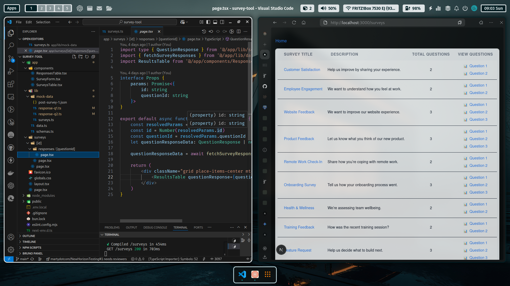

# 📝 Lightweight Survey Tool

A comprehensive survey application built with **Next.js 14**, **TypeScript**, and **Tailwind CSS**. This tool enables users to browse surveys, complete them via dynamically rendered forms, and receive immediate feedback on submission, all while demonstrating robust client-side validation with Zod.

---

## 📦 Getting Started

1. Clone the repo

```bash
git clone https://github.com/theWhiteFox/survey-tool-app.git
cd survey-tool-app
```

2. Install dependencies

```bash
bun install 
# or 
npm install
```

3. Configure environment variables

Create a .env.local file in the root of the project:

```
NEXT_PUBLIC_APP_BASE_URL=http://localhost:3000
API_TOKEN=your_api_token_here # Replace with your actual API token
``` 
_The API_TOKEN is necessary for authenticating requests to the Workspace API. The `NEXT_PUBLIC_APP_BASE_URL` is used for constructing absolute URLs when making server-side API calls._

4. Start the dev server

```bash
bun dev
# or
npm run dev
``` 

### Running locally this is what you will see 🤞

Open http://localhost:3000 in your browser. Click the link to the surveys to see a list of available surveys.



## 🗂 Project Structure

```bash
survey-tool-app/
├── public/
├── src/
│   ├── app/
│   │   ├── components/              # Reusable UI components for the app directory
│   │   │   ├── QuestionField.tsx    # Renders individual input fields based on question type
│   │   │   ├── ResponsesTable.tsx   # Displays a table of survey responses
│   │   │   ├── SurveyForm.tsx       # Client-side form component handling submission and validation
│   │   │   └── SurveysTable.tsx     # Displays a table of available surveys
│   │   ├── lib/
│   │   │   ├── mock-data/           # Folder for mock API responses
│   │   │   │   ├── surveys.ts       # Mock data for survey list
│   │   │   │   └── response-q1.ts   # Mock data for individual question responses (example)
│   │   │   ├── data.ts              # Centralized API calls, authentication headers
│   │   │   └── schemas.ts           # Zod schemas for API response structures AND client-side form validation
│   │   ├── globals.css              # Global styles for the application
│   │   ├── layout.tsx               # Root layout for the application
│   │   ├── page.tsx                 # Home page (redirects to /surveys)
│   │   └── surveys/
│   │       ├── [surveyId]/          # Dynamic page for individual surveys (Server Component)
│   │       │   └── page.tsx
│   │       ├── responses/           # Folder for displaying survey responses/results
│   │       │   ├── [questionId]/    # Dynamic page for individual question responses
│   │       │   │   └── page.tsx
│   │       │   └── page.tsx         # Survey list page (Server Component)
├── .env.local                       # Environment variables (API keys, base URLs)
├── next.config.js                   # Next.js configuration (no rewrites needed as CORS is handled by API)
├── package.json                     # Project dependencies and scripts
├── tsconfig.json                    # TypeScript configuration
└── README.md                        # Project documentation
```

## 📝 Learning Reflection

This project was a valuable journey into building a robust and user-friendly frontend application integrated with a real API.

Read more [From 500 Errors to UX Wins: API Debugging in a Real-World Next.js 14 Apps](https://www.thewhitefoxdev.blog/blog/survey-tool-next)
