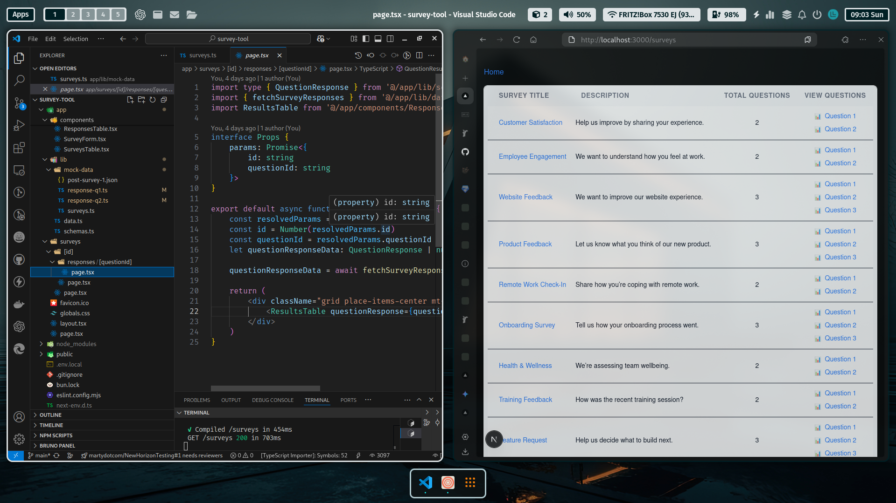

# 📝 Lightweight Survey Tool

A comprehensive survey application built with **Next.js 14**, **TypeScript**, and **Tailwind CSS**. This tool enables users to browse surveys, complete them via dynamically rendered forms, and receive immediate feedback on submission, all while demonstrating robust client-side validation with Zod.

---

## 🚀 Features

* **Dynamic Survey Listing:** Fetches and displays a list of available surveys from the API, including their titles and basic info in a responsive table.
* **API-Driven Form Rendering:** Questions for each survey are dynamically rendered based on data retrieved directly from the API, supporting various types like `single_choice`, `multiple_choice`, `number`, and `text` inputs.
* **Comprehensive Submission Handling:** Manages the entire process of collecting user responses, transforming them into the API's expected format, and sending them via `POST` requests.
* **Robust Client-Side Validation with Zod:** User input is validated against predefined Zod schemas before being sent to the API, ensuring data integrity and providing immediate, clear error feedback to the user.
* **Clear User Feedback:** Provides distinct visual cues and messages for successful submissions, validation errors, API failures, and general submission issues.
* **Modular & Maintainable Architecture:** Designed with reusable components and a clear separation of concerns (e.g., API service, validation schemas, UI components) for enhanced maintainability and scalability.
* **Responsive UI:** Styled with **Tailwind CSS** to ensure a seamless and accessible experience across devices and screen sizes.
* **API Resilience with Mock Data Fallback:** Includes a fallback to mock data for the list of surveys, survey questions, and individual survey question responses when the live API is unreachable, ensuring continuous development and testing.

---

## 🛠 Tech Stack

* ⚡ **Next.js 14+ (App Router):** Utilized for server-side rendering (SSR), intelligent routing, and efficient data fetching.
* 🧠 **TypeScript:** Ensures strong typing throughout the codebase, improving code quality and reducing bugs.
* 🎨 **Tailwind CSS:** A utility-first CSS framework for rapid and consistent styling.
* ✅ **Zod:** A powerful, TypeScript-first schema declaration and validation library.
* 🌐 **Workspace API:** The backend API providing survey data and accepting survey responses.

---

## 📦 Getting Started

1. Clone the repo

```bash
git clone [https://github.com/theWhiteFox/survey-tool-app.git](https://github.com/theWhiteFox/survey-tool-app.git)
cd survey-tool-app
```

2. Install dependencies

```bash
bun install 
# or 
npm install
```

3. Configure environment variables

Create a .env.local file in the root of the project:

```
NEXT_PUBLIC_API_BASE_URL=[https://interview.staging.company.com](https://interview.staging.company.com)
NEXT_PUBLIC_APP_BASE_URL=http://localhost:3000
API_TOKEN=your_api_token_here # Replace with your actual API token
``` 
_The API_TOKEN is necessary for authenticating requests to the Workspace API. The NEXT_PUBLIC_APP_BASE_URL is used for constructing absolute URLs when making server-side API calls._

4. Start the dev server

```bash
bun dev
# or
npm run dev
``` 

### Running locally this is what you will see 🤞

Open http://localhost:3000 in your browser. Click the link to the surveys to see a list of available surveys.



## 🧠 Design Notes

- **Next.js App Router for Performance & Security:** I have leveraged Next.js App Router to differentiate between **Server Components** (for fetching a list of surveys with links and details of each survey, preventing API tokens from being exposed client-side) and **Client Components** (like the `SurveyForm` component, for interactive elements and form handling). This optimizes performance and security.
- **Modular API Layer (`app/lib/data.js`):** All interactions with the `Workspace` API are centralized here. This modularity ensures consistent error handling, authentication, and provides a clear separation of concerns, making the codebase easier to maintain and extend. Mock data fallbacks are included for development resilience.
- **Strongly Typed Forms with Zod:** Client-side form submissions are rigorously validated using **Zod schemas**. This ensures that the data sent to the API conforms to expected types and formats, reducing invalid requests and providing immediate, clear feedback to the user, enhancing the overall UX.
- **User-Centric Feedback:** the UI provides distinct messages and visual cues for various submission outcome: success, specific validation errors, API call failures, and general "Not Submitted" messages for unhandled issues.

## 🗂 Project Structure

```bash
survey-tool-app/
├── public/
├── src/
│   ├── app/
│   │   ├── components/              # Reusable UI components for the app directory
│   │   │   ├── QuestionField.tsx    # Renders individual input fields based on question type
│   │   │   ├── ResponsesTable.tsx   # Displays a table of survey responses
│   │   │   ├── SurveyForm.tsx       # Client-side form component handling submission and validation
│   │   │   └── SurveysTable.tsx     # Displays a table of available surveys
│   │   ├── lib/
│   │   │   ├── mock-data/           # Folder for mock API responses
│   │   │   │   ├── surveys.ts       # Mock data for survey list
│   │   │   │   └── response-q1.ts   # Mock data for individual question responses (example)
│   │   │   ├── data.ts              # Centralized API calls, authentication headers
│   │   │   └── schemas.ts           # Zod schemas for API response structures AND client-side form validation
│   │   ├── globals.css              # Global styles for the application
│   │   ├── layout.tsx               # Root layout for the application
│   │   ├── page.tsx                 # Home page (redirects to /surveys)
│   │   └── surveys/
│   │       ├── [surveyId]/          # Dynamic page for individual surveys (Server Component)
│   │       │   └── page.tsx
│   │       ├── responses/           # Folder for displaying survey responses/results
│   │       │   ├── [questionId]/    # Dynamic page for individual question responses
│   │       │   │   └── page.tsx
│   │       │   └── page.tsx         # Survey list page (Server Component)
├── .env.local                       # Environment variables (API keys, base URLs)
├── next.config.js                   # Next.js configuration (no rewrites needed as CORS is handled by API)
├── package.json                     # Project dependencies and scripts
├── tsconfig.json                    # TypeScript configuration
└── README.md                        # Project documentation
```

## 📝 Learning Reflection

This project was a valuable journey into building a robust and user-friendly frontend application integrated with a real API.

I'm also currently writing a blog post to reflect on what I learned during this project — including dynamic component rendering, Zod validation patterns, and managing typed form state. Post coming soon!
